# Wire Frames 
This section only show the wire frames for what has currently been implemented. Please refer to the project's 
[figma](https://www.figma.com/design/A2DXLoJH7QvZ6RzI711zUC/WorkWise?node-id=0-1&t=mAFPbit2in8F1o5m-0) board for more.

## Splash page
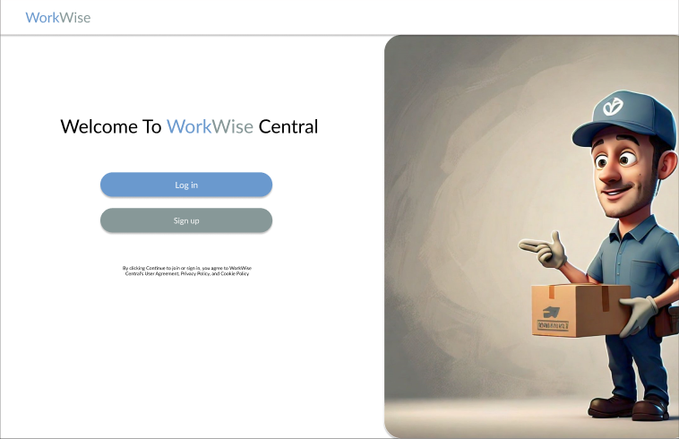
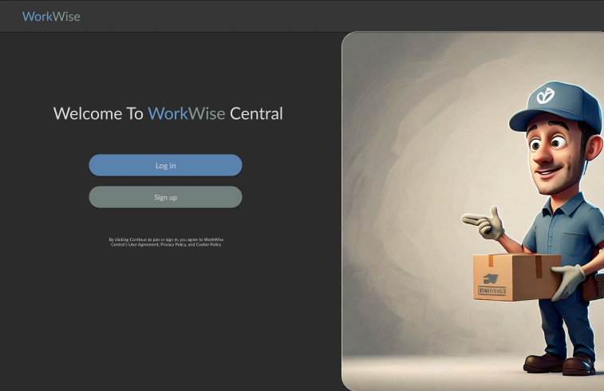

## Sign up 
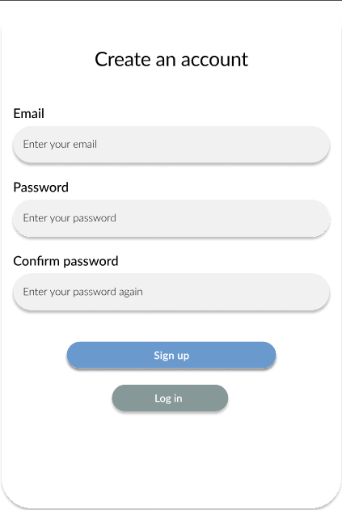
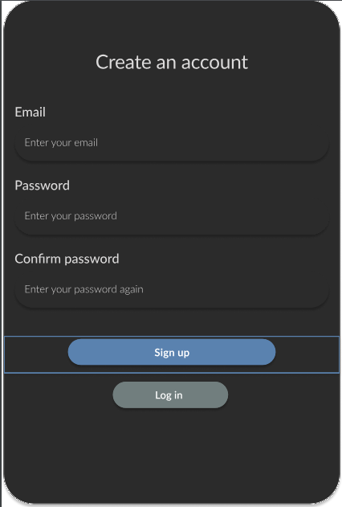

## Sign up flow
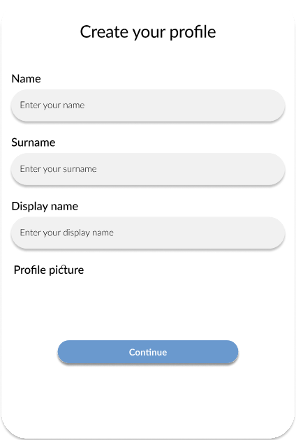
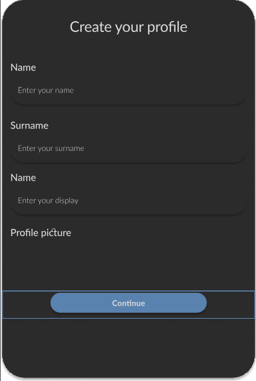
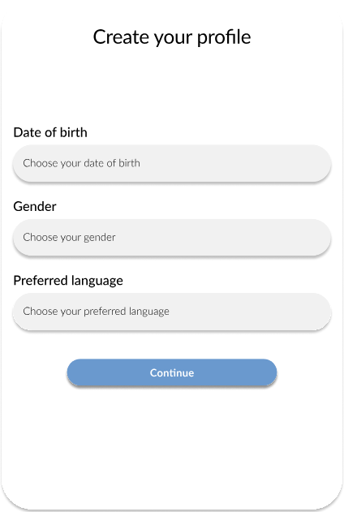
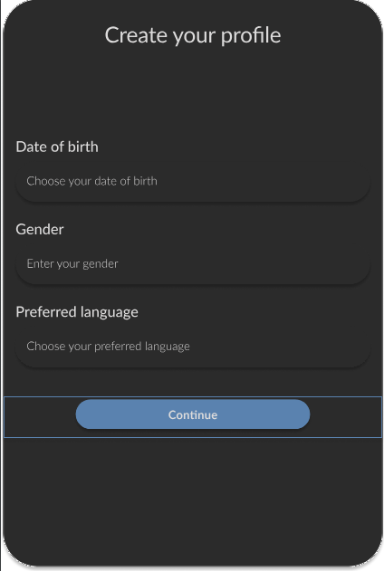

<>
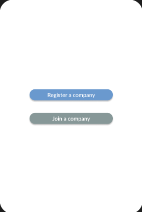

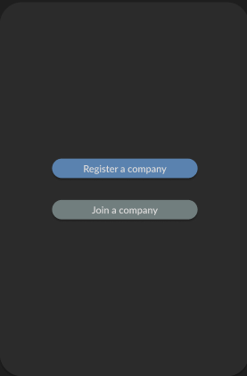

## Log in 
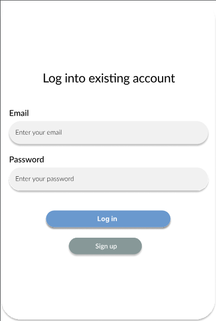
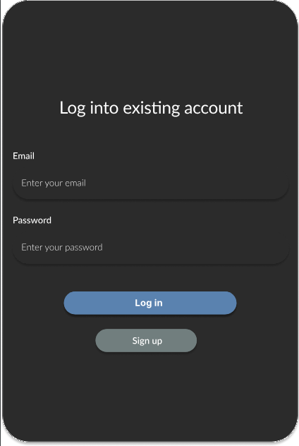

## Register Company 
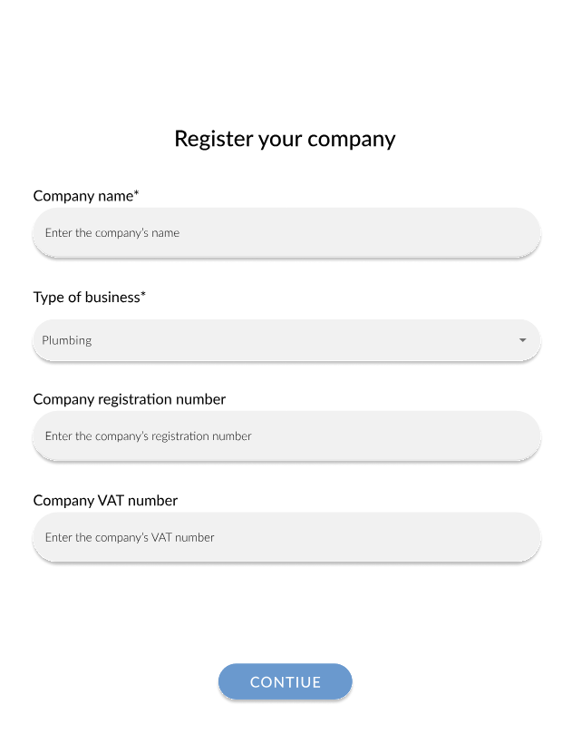
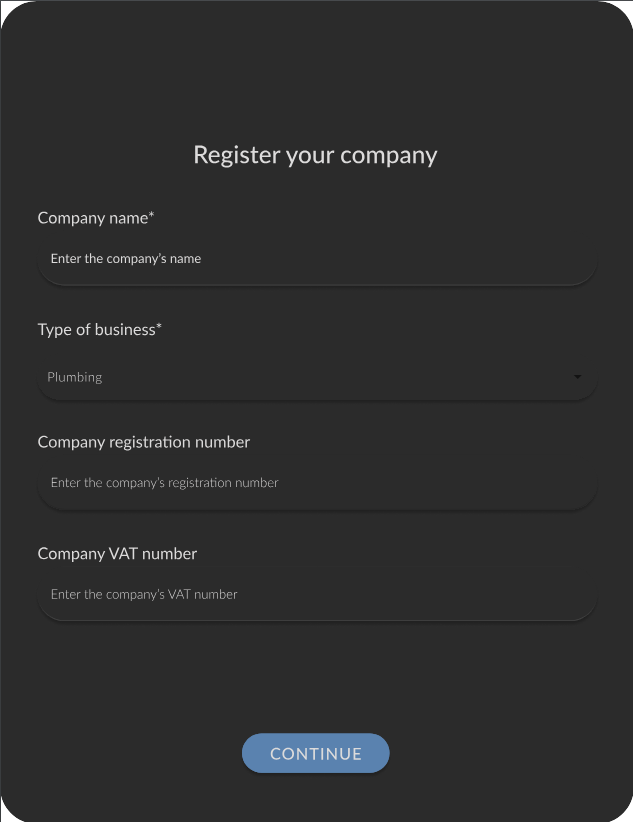
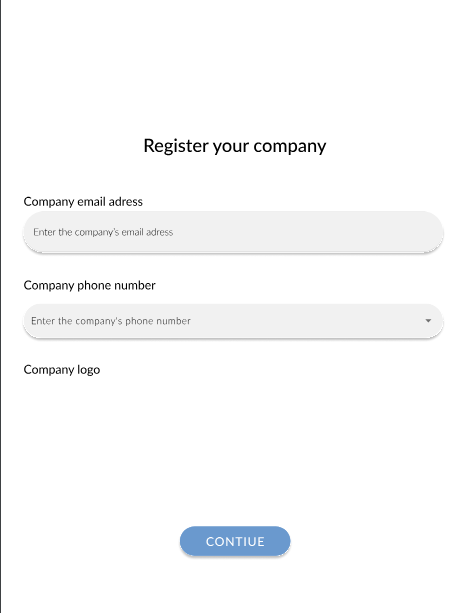
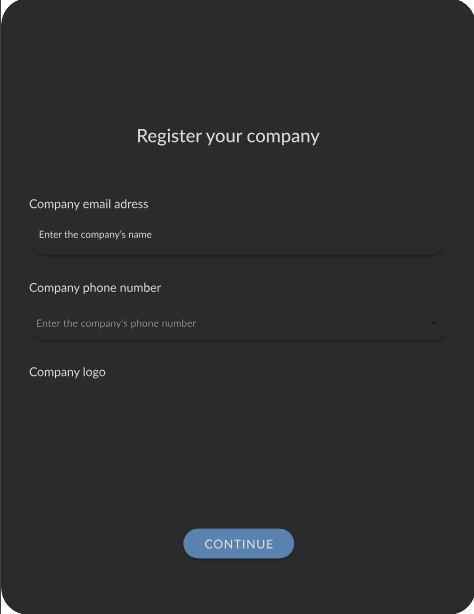

## Join company 
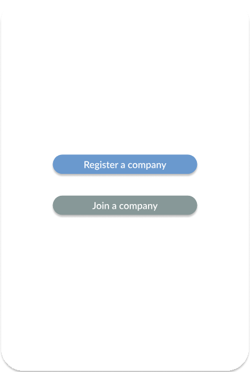
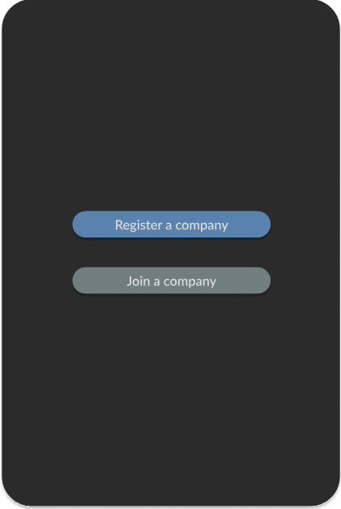

## Add client 
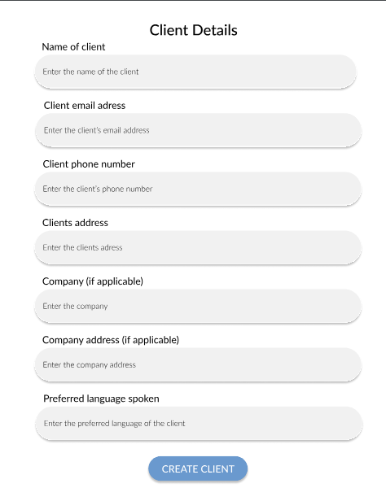
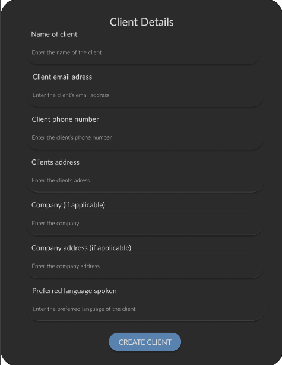

## Add job 
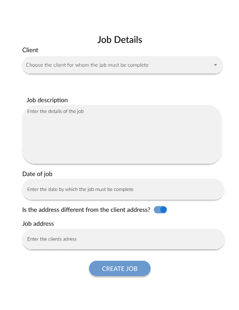
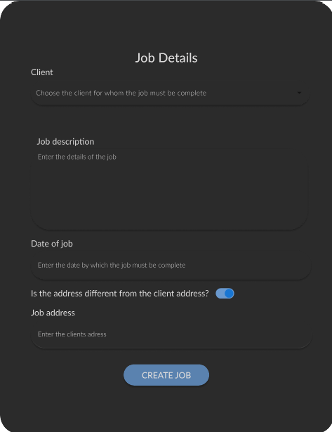

## Add employee
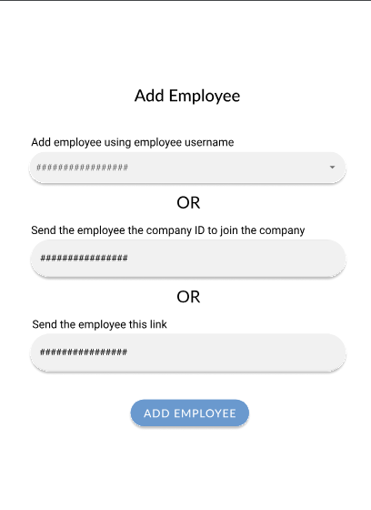
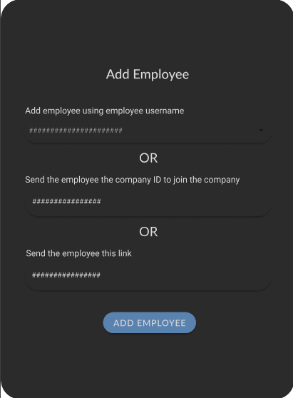
